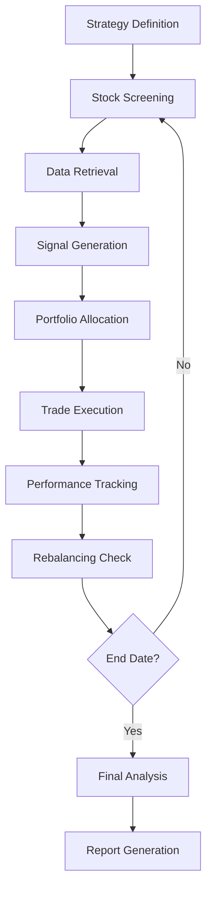

# Trading Backtest System - Project Architecture & File Guide

## 🎯 Project Overview

The Trading Backtest System is a comprehensive Python framework for testing trading strategies with professional-grade analytics, reporting, and data management capabilities. It supports both SQLite (development) and PostgreSQL/TimescaleDB (production) databases, with full Docker support for easy deployment.

## 📁 Project Structure & File Documentation

```
trading-backtest/
├── 🐳 Docker & Deployment
├── ⚙️ Configuration & Environment
├── 🧠 Core Components
├── 📊 Data Management
├── 💼 Trading Strategies
├── 📈 Backtesting Engine
├── 📋 Reporting & Visualization
├── 🔧 Scripts & Utilities
├── 🧪 Testing
└── 📚 Documentation
```

---

## 🐳 Docker & Deployment

### `Dockerfile`
**Purpose:** Multi-stage Docker container for the application
**Features:**
- Python 3.11 slim base image
- PostgreSQL client libraries
- Non-root user security
- Health checks
- Optimized layer caching

### `docker-compose.yml`
**Purpose:** Complete development and production environment orchestration
**Services:**
- **database:** TimescaleDB with PostgreSQL 15
- **app:** Main application container
- **jupyter:** Optional Jupyter notebook server (profile: jupyter)
- **redis:** Optional caching layer (profile: cache)
**Features:** Health checks, data persistence, network isolation

### `.env.docker`
**Purpose:** Docker-specific environment configuration template
**Contains:** Database connection strings, API keys, application settings

### `scripts/docker-setup.sh` & `scripts/docker-setup.bat`
**Purpose:** Automated Docker environment setup for Linux/macOS and Windows
**Functions:** Docker validation, image building, database initialization, service orchestration

---

## ⚙️ Configuration & Environment

### `config/`
Central configuration management package

#### `config/__init__.py`
**Purpose:** Package initialization for configuration module

#### `config/settings.py`
**Purpose:** Main application configuration
**Key Features:**
- Environment variable loading via python-dotenv
- Database URL construction (SQLite/PostgreSQL)
- API key management (Financial Modeling Prep)
- Logging configuration
- Cache settings
- Backtest defaults (capital, commission, slippage)

#### `config/constants.py`
**Purpose:** Application-wide constants and enums
**Contains:** Market data constants, strategy parameters, financial calculations

### `.env` & `.env.example`
**Purpose:** Environment variable templates
**Contains:** API keys, database credentials, debug settings
**Note:** `.env` is git-ignored, `.env.example` is the template

---

## 🧠 Core Components

### `backtest/`
Core backtesting engine package

#### `backtest/__init__.py`
**Purpose:** Package initialization and exports

#### `backtest/engine.py`
**Purpose:** Main backtesting orchestration engine
**Key Classes:**
- `BacktestEngine`: Coordinates strategy execution, portfolio management, and performance tracking
**Key Methods:**
- `run()`: Execute backtest over date range
- `_execute_rebalance()`: Handle portfolio rebalancing
- `_calculate_portfolio_value()`: Track portfolio performance
**Integrations:** Connects strategies, data sources, and performance analytics

#### `backtest/performance.py`
**Purpose:** Portfolio performance analytics and risk metrics
**Key Classes:**
- `PerformanceAnalyzer`: Calculate returns, Sharpe ratio, drawdowns, volatility
**Key Metrics:** Total return, annualized return, Sharpe ratio, max drawdown, win rate, beta

---

## 📊 Data Management

### `data/`
Data access layer and database management

#### `data/__init__.py`
**Purpose:** Package initialization

#### `data/database.py`
**Purpose:** Database connection and session management
**Key Classes:**
- `DatabaseManager`: SQLAlchemy session management, connection pooling
**Key Features:**
- Context managers for safe transactions
- Health checks and connection validation
- TimescaleDB hypertable creation
- Migration support

#### `data/models.py`
**Purpose:** SQLAlchemy ORM models for data persistence
**Key Models:**
- `Stock`: Company metadata and identifiers
- `PriceData`: OHLCV price data with TimescaleDB optimization
- `FundamentalData`: Financial statement data
- `BacktestRun`: Backtest execution metadata
- `Trade`: Individual trade records
- `PortfolioSnapshot`: Historical portfolio states

#### `data/connectors/`
External data source integrations

##### `data/connectors/__init__.py`
**Purpose:** Connector package initialization

##### `data/connectors/base.py`
**Purpose:** Abstract base class for data connectors
**Features:** Rate limiting, caching, error handling, data validation

##### `data/connectors/fmp.py`
**Purpose:** Financial Modeling Prep API connector
**Endpoints:** Price data, company profiles, financial statements, market data
**Features:** API key management, request throttling, data transformation

---

## 💼 Trading Strategies

### `strategies/`
Strategy development framework

#### `strategies/__init__.py`
**Purpose:** Package initialization and strategy registry

#### `strategies/base.py`
**Purpose:** Abstract base class for all trading strategies
**Key Abstract Methods:**
- `screen_stocks()`: Stock universe filtering
- `generate_signals()`: Buy/sell signal generation
- `allocate_portfolio()`: Position sizing and weights
**Built-in Features:** Data management, metadata tracking, parameter handling

#### `strategies/screening.py`
**Purpose:** Stock screening and filtering utilities
**Key Classes:**
- `StockScreener`: Market cap, fundamental, and technical filters
**Filters:** Market cap ranges, P/E ratios, volume thresholds, sector filters

#### `strategies/signals.py`
**Purpose:** Trading signal generation algorithms
**Key Classes:**
- `SignalGenerator`: Technical indicators, momentum signals, mean reversion
**Signals:** Moving average crossovers, RSI, MACD, Bollinger Bands

#### `strategies/allocation.py`
**Purpose:** Portfolio allocation and position sizing
**Key Classes:**
- `PortfolioAllocator`: Equal weight, market cap weight, risk parity, custom weights
**Methods:** Risk budgeting, volatility targeting, concentration limits

---

## 📈 Backtesting Engine Workflow



---

## 📋 Reporting & Visualization

### `reporting/`
Professional report generation

#### `reporting/__init__.py`
**Purpose:** Package initialization

#### `reporting/pdf_generator.py`
**Purpose:** PDF report creation with ReportLab
**Features:**
- Executive summary pages
- Performance charts and tables
- Risk analysis sections
- Trade logs and statistics
- Customizable templates

#### `reporting/visualizations.py`
**Purpose:** Chart and graph generation with matplotlib/seaborn
**Chart Types:**
- Equity curves
- Drawdown charts
- Return distributions
- Risk-return scatter plots
- Sector allocation pie charts

### `reports/`
**Purpose:** Output directory for generated PDF reports
**Note:** Files are git-ignored, created during backtest execution

---

## 🔧 Scripts & Utilities

### `scripts/`
Utility scripts and database management

#### `scripts/setup_db.py`
**Purpose:** Database initialization and table creation
**Functions:** Schema creation, TimescaleDB setup, health checks

#### `scripts/init_timescale.sql`
**Purpose:** SQL script for TimescaleDB extension setup
**Features:** Extension installation, hypertable preparation

#### `scripts/examples/`
Example strategy implementations

##### `scripts/examples/buy_sell_threshold_strategy.py`
**Purpose:** Simple price-based trading strategy example
**Strategy:** Buy above $100, sell below $80
**Features:** Equal weighting, daily rebalancing

##### `scripts/examples/market_cap_strategy.py`
**Purpose:** Market capitalization-based strategy example
**Strategy:** Weight by market cap, periodic rebalancing
**Features:** Market cap screening, volatility targeting

---

## 🧪 Testing

### `tests/`
Comprehensive testing suite

#### `tests/__init__.py`
**Purpose:** Test package initialization

#### `tests/test_basic.py`
**Purpose:** Unit tests for core functionality
**Coverage:**
- Module imports and initialization
- Strategy base class functionality
- Backtest engine initialization
- Method signature validation

### `test_integration.py`
**Purpose:** End-to-end integration testing
**Coverage:**
- Complete backtest workflow
- Database connectivity
- Settings loading
- Strategy execution
- Example strategy validation

### `verify_setup.py`
**Purpose:** System health check and validation
**Checks:**
- Python version compatibility
- Required package availability
- Project structure integrity
- Configuration file presence
- Core module imports

---

## 📚 Documentation & Configuration

### `README.md`
**Purpose:** Project documentation and quick start guide
**Sections:** Features, installation, usage examples, API reference

### `LICENSE`
**Purpose:** MIT license for open source distribution

### `setup.py`
**Purpose:** Python package installation configuration
**Features:** Dependency management, entry points, metadata

### `requirements.txt`
**Purpose:** Python dependency specification
**Categories:** Core libraries, data analysis, visualization, testing, optional components

### `.gitignore`
**Purpose:** Git version control exclusions
**Excludes:** Environment files, databases, caches, Docker volumes, generated reports

---

## 🔄 Component Interconnections

### Data Flow Architecture

```
External APIs (FMP) 
    ↓
Data Connectors 
    ↓
Database (TimescaleDB/SQLite) 
    ↓
Strategy Screening & Signals 
    ↓
Backtest Engine 
    ↓
Performance Analytics 
    ↓
Report Generation
```

### Key Integration Points

1. **Configuration Hub**: `config/settings.py` provides environment-specific settings to all components
2. **Database Layer**: `data/database.py` manages all data persistence and retrieval
3. **Strategy Interface**: `strategies/base.py` defines the contract between strategies and the backtest engine
4. **Performance Pipeline**: `backtest/performance.py` processes engine output for reporting
5. **Docker Orchestration**: `docker-compose.yml` connects all services with proper networking and dependencies

### Extension Points

- **New Data Sources**: Implement `data/connectors/base.py` interface
- **Custom Strategies**: Inherit from `strategies/base.py`
- **Additional Metrics**: Extend `backtest/performance.py`
- **Report Formats**: Add templates to `reporting/`
- **Database Backends**: Configure new engines in `data/database.py`

---

## 🚀 Getting Started

### Local Development
```bash
python verify_setup.py          # System check
python -m pytest -v            # Run tests
python scripts/examples/buy_sell_threshold_strategy.py  # Example run
```

### Docker Development
```bash
# Windows
scripts\docker-setup.bat

# Linux/macOS
chmod +x scripts/docker-setup.sh
./scripts/docker-setup.sh

# Start all services
docker-compose up -d

# Run a backtest
docker-compose run --rm app python scripts/examples/buy_sell_threshold_strategy.py
```

### Production Deployment
```bash
# Copy and configure environment
cp .env.docker .env.docker.local
# Edit .env.docker.local with production settings

# Deploy with PostgreSQL
docker-compose up -d database app

# Optional: Add Jupyter for analysis
docker-compose --profile jupyter up -d jupyter

# Optional: Add Redis for caching
docker-compose --profile cache up -d redis
```

This architecture provides a scalable, maintainable, and extensible framework for quantitative trading strategy development and backtesting.
